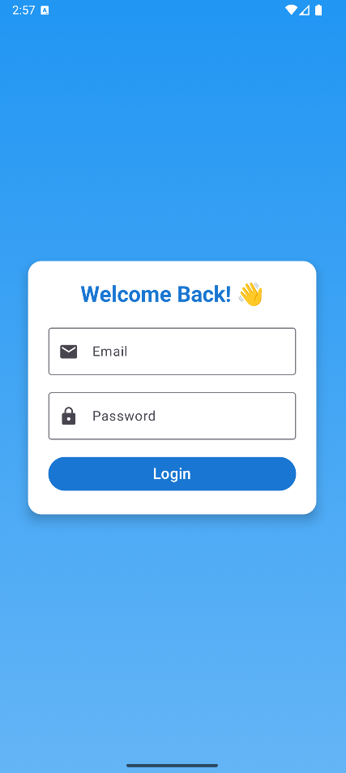
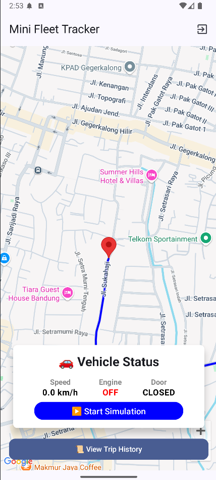
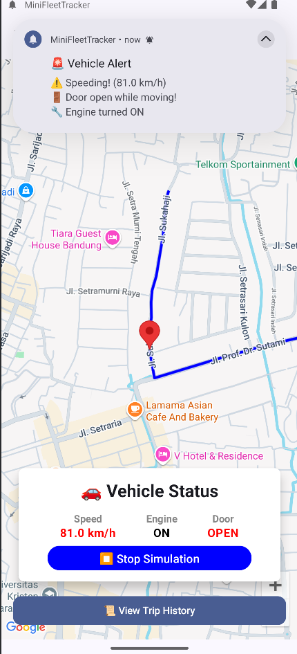
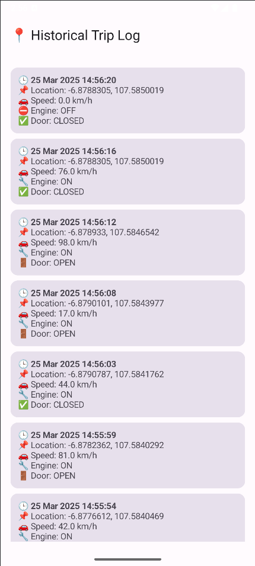

# MiniFleetTracker

MiniFleetTracker is an Android application that simulates vehicle tracking, displaying real-time vehicle state updates including speed, engine status, and door state. The project uses Kotlin, Jetpack Compose, ViewModel, and StateFlow to manage simulation and UI updates.

## Features
- 🚗 **Vehicle Simulation**: Generates random vehicle states including speed, engine status, and door open/close.
- 📍 **Location Tracking**: Updates vehicle location based on predefined routes.
- 🔔 **Notifications**: Sends alerts for speeding, door open while moving, and engine state changes.
- 📊 **Trip Logging**: Saves vehicle state changes for tracking history.

## Technologies Used
- Kotlin
- Jetpack Compose
- ViewModel + StateFlow
- WorkManager (for notifications)
- Room Database (for trip logs)
- Google Maps API
- Firebase Auth
- Local Background Service

## Installation
1. Clone the repository:
   ```sh
   git clone https://github.com/dindamajesty13/MiniFleetTracker.git
   ```
2. Open the project in Android Studio.
3. Sync dependencies and build the project.
4. Run the app on an emulator or physical device.

## How to Use
1. **Login**: Enter email and password to authenticate.
2. **Start Simulation**: Tap the ▶️ button to begin the vehicle tracking simulation.
3. **View Vehicle Status**: Monitor speed, engine state, and door status in real time.
4. **Stop Simulation**: Tap the ⏹️ button to end the simulation.
5. **View Trip History**: Tap trip history button to view log trip.

## Screenshots
<p align="center">
  
  
  
  
</p>

## Demo Video
[Watch the demo](https://github.com/dindamajesty13/MiniFleetTracker/tree/master/screenshots/demo.mp4)


## Future Enhancements
- REST API integration for remote vehicle management
- Improved UI/UX with animations and charts

## Contributing
Feel free to fork the project, create a feature branch, and submit a pull request.

## License
This project is licensed under the MIT License - see the [LICENSE](LICENSE) file for details.

## Contact
For inquiries and support, reach out to majestydinda@gmail.com or open an issue in the repository.
